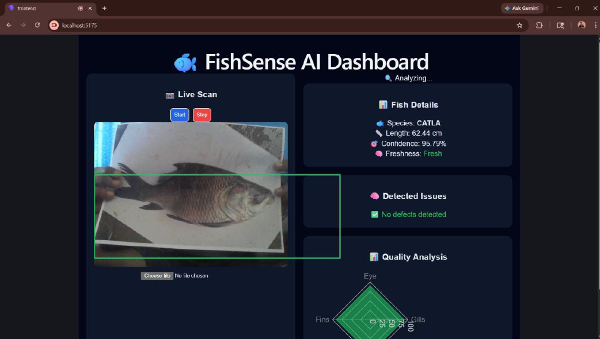
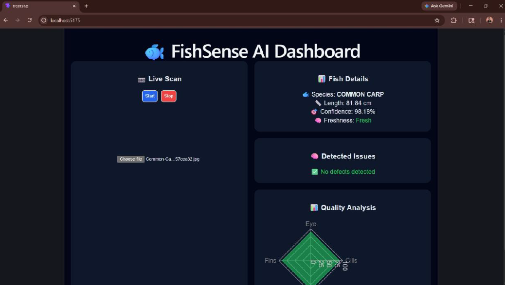
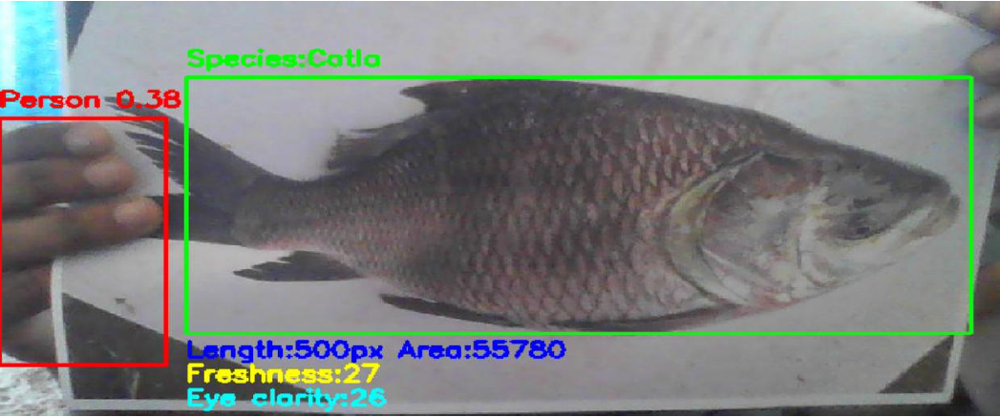

# FishSense – AI Fish Freshness Detection System

AI-powered fish freshness detection system using YOLOv8, OpenCV, Flask, React, and Computer Vision for real-time quality assessment.

---

# 📸 Dashboard Preview

## Live Detection Dashboard



---

## Detection Output



---

## YOLO Output



---

# 🚀 Features

- Real-time fish freshness detection
- YOLOv8 object detection
- Flask backend API
- React frontend dashboard
- OpenCV image processing
- Fish species identification
- Freshness classification
- Defect detection
- Interactive radar chart visualization

---

# 🛠️ Tech Stack

## Frontend
- React
- Vite
- JavaScript
- CSS
- Recharts

## Backend
- Flask
- Python
- OpenCV
- YOLOv8 (Ultralytics)
- NumPy

---

# 📂 Project Structure

```bash
FishSense-AI-Fish-Freshness-Detection/
│
├── backend/
│   ├── app.py
│   └── requirements.txt
│
├── frontend/src/
│   ├── App.jsx
│   ├── index.css
│   ├── main.jsx
│   ├── package.json
│   └── package-lock.json
│
├── dashboard.png
├── detection.png
├── yolo_output.png
│
├── README.md
└── LICENSE
```

---

# ⚙️ Backend Setup

```bash
cd backend
pip install -r requirements.txt
python app.py
```

Backend runs on:

```bash
http://127.0.0.1:5000
```

---

# 💻 Frontend Setup

```bash
cd frontend
npm install
npm run dev
```

Frontend runs on:

```bash
http://localhost:5173
```

---

# 🔍 System Workflow

```text
Image Upload
    ↓
Flask Backend
    ↓
YOLOv8 Detection
    ↓
Species Identification
    ↓
Freshness Analysis
    ↓
Dashboard Visualization
```

---

# 📊 Detection Details

The system analyzes:

- Fish species
- Confidence score
- Fish freshness
- Detected defects
- Estimated fish length
- Quality metrics visualization

---

# 🧠 AI Model

The project uses:

- YOLOv8 for fish detection
- OpenCV for image processing
- Rule-based freshness classification

---

# 📈 Sample Detection Output

```json
{
  "species": "CATLA",
  "freshness": "Fresh",
  "confidence": 95.79,
  "length": {
    "value": 62.44
  }
}
```

---

# 🎯 Applications

- Fish markets
- Seafood quality monitoring
- Food safety systems
- Smart inspection systems
- AI-based freshness analysis

---

# 👨‍💻 Developer

Akshaya

---

# 📜 License

This project is licensed under the MIT License.
